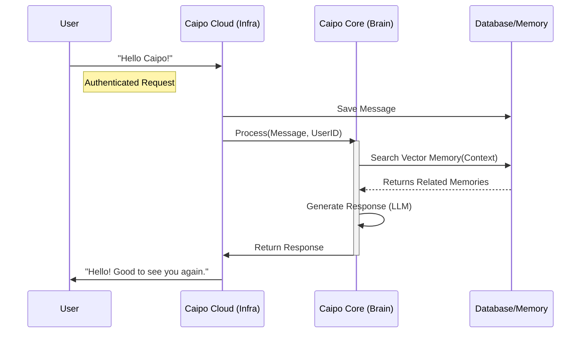

# Architecture: Cloud vs. Brain

## 🧠 The Concept
To build a truly scalable AI ecosystem, we separate **Infrastructure** (Cloud) from **Intelligence** (Brain).

| Component | Metaphor | Responsibility | Tech Stack |
|:---|:---|:---|:---|
| **Caipo Cloud** | **The Nervous System** | Moves data, stores memories, handles auth, routes messages. | Python (FastAPI), Postgres, Redis |
| **Caipo Core** | **The Mind** | Thinks, decides, plans, processes context, generates personality. | Python (LangChain/LLM), Vector Logic |

---

## 🏗️ 1. Caipo Cloud (The Backend)
**"The Plumbing"**
The Cloud is the stable infrastructure layer. It does not "think"; it serves.

### Responsibilities:
*   **User Management**: Login/Signup, API Keys (Supabase/Auth0).
*   **Device Registry**: Keeping track of connected robots (MQTT/WebSockets).
*   **Memory Storage**: Saving vector embeddings to the database (Pinecone/pgvector).
*   **API Gateway**: The single entry point for the Website and Mobile App.

### Example Flow:
> User sends a message -> Cloud authenticates User -> Cloud saves message to DB -> Cloud forwards message to **Brain**.

---

## 💡 2. Caipo Core (The Brain)
**"The Intelligence"**
The Core is the runtime that processes information. It can run in the Cloud *or* locally on a powerful robot (Edge).

### Responsibilities:
*   **Cognitive Loop**: Observe -> Orient -> Decide -> Act.
*   **Context Retrieval**: "What did the user say last week?" (Queries Cloud Memory).
*   **Tool Execution**: "I need to turn on the lights" (Sends command to Cloud).
*   **Persona**: "I am a helpful assistant."

### Example Flow:
> Brain receives message -> Brain queries Memory -> Brain generates answer -> Brain sends answer back to **Cloud**.

---

## 🔄 Interaction Diagram

## 🚀 Why Split Them?
1.  **Scalability**: You can have 1 Cloud handling 1,000 Brain instances (one per user, or one per robot).
2.  **Portability**: The **Brain** can be moved. You can run `caipo-core` on a local NVIDIA Jetson robot for zero latency, while `caipo-cloud` stays online to sync data later.
3.  **Modularity**: You can upgrade the Brain (e.g., switch from GPT-4 to Claude 3) without touching the Cloud infrastructure.
